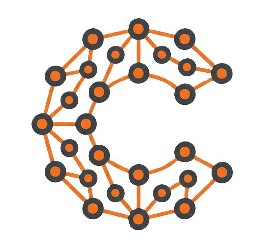
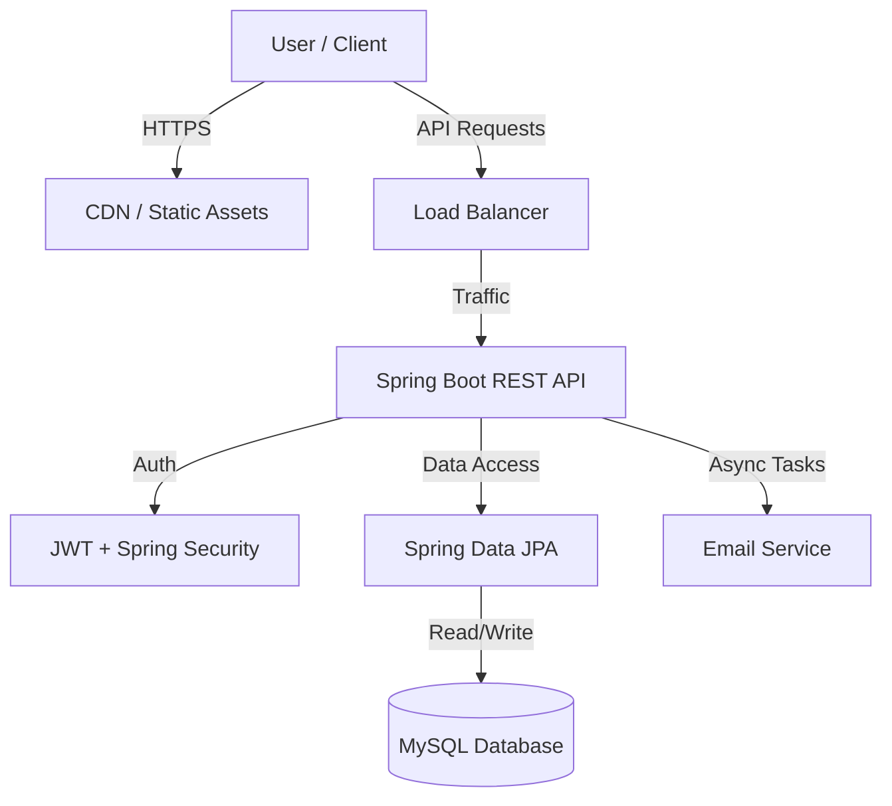
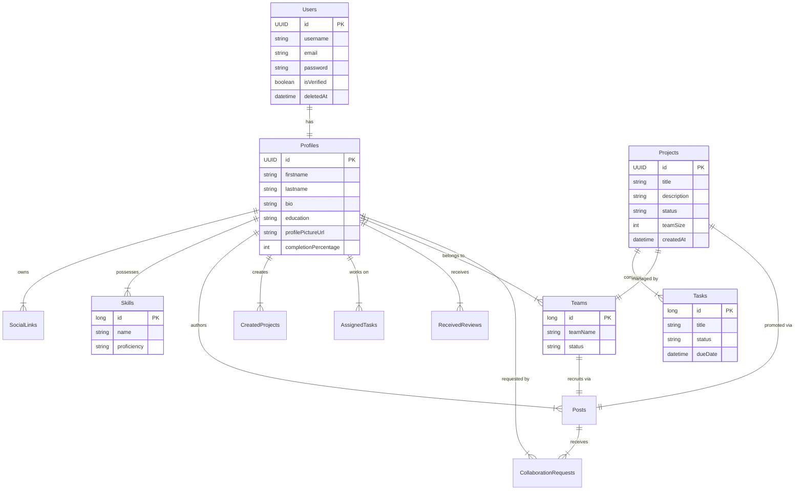

<p align="center">
  
</p>

# Collabro 🚀

> **Connect. Collaborate. Create.**  
> A comprehensive platform designed to bridge the gap between developers, designers, and creators, enabling seamless team formation and project collaboration.


---

## 📖 Table of Contents

- [Idea & Scope](#-idea--scope)
- [System Design](#-system-design)
- [Database Architecture](#-database-architecture)
- [Core Features](#-core-features)
- [Tech Stack](#-tech-stack)
- [Getting Started](#-getting-started)
- [Future Roadmap](#-future-roadmap)

---

## 💡 Idea & Scope

**Collabro** serves as a specialized networking ecosystem where individuals can showcase their skills, find specific projects that match their interests, and form teams. Unlike generic social networks, Collabro focuses on **skill-based matching** and **project lifecycle management**.

### Application Scope

The current implementation covers:

1.  **User Identity**: Secure authentication, profile building, and portfolio management.
2.  **Project Marketplace**: Users can post project ideas, recruit members, and browse opportunities.
3.  **Team Formation**: Automated and manual team creation with role-based member management.
4.  **Collaboration Tools**: Task assignment, progress tracking, and peer reviews.

---

## 🏗 System Design

Collabro follows a robust **Monolithic Architecture** (migratable to Microservices) with a clear separation of concerns between the Client and Server.

- **Frontend**: A Single Page Application (SPA) built with React and Vite, optimized for performance and responsiveness.
- **Backend**: A RESTful API service developed with Spring Boot, handling business logic, security, and data persistence.
- **Database**: Relational data model using MySQL for structured data integrity.

### High-Level Architecture



---

## 💾 Database Architecture

The database is designed to handle complex relationships between users, teams, and projects. Below is the Entity Relationship (ER) Diagram representing the core schema.

### ER Diagram



---

## ✨ Core Features

### 🔐 Authentication & Security

- **Secure Registration/Login** with JWT (JSON Web Tokens).
- **Email Verification** using OTP.
- **Role-Based Access Control** (User/Admin).
- **Password Management** (hashing, reset flows).

### 👤 Profile Management

- **Skill Matrix**: Add skills with proficiency levels.
- **Social Integration**: Link GitHub, LinkedIn, and Portfolio.
- **Profile Strength**: Real-time calculation of profile completeness.
- **Avatar Management**: Upload and manage profile pictures.

### 🚀 Project & Team Collaboration

- **Project Creation**: Detailed project specs including tech stack and expected duration.
- **Team Assembly**: Create teams, invite members, and manage rosters.
- **Task Board**: Assign tasks to specific team members with deadlines.
- **Reviews**: Peer review system to build reputation.

### 🤝 Networking

- **Collaboration Requests**: Apply to join projects or teams.
- **Smart Matching**: (Upcoming) Algorithm to recommend projects based on skills.
- **Matchmaking & search**: Find developers and projects based on filters.

---

## 🛠 Tech Stack

### Frontend (Client)

| Tech             | Description                                    |
| :--------------- | :--------------------------------------------- |
| **React 18**     | UI Library for building interactive interfaces |
| **Vite**         | Next Generation Frontend Tooling               |
| **TypeScript**   | Static typing for better developer experience  |
| **TailwindCSS**  | Utility-first CSS framework for styling        |
| **Lucide React** | Beautiful & consistent icon set                |
| **Axios**        | Promise based HTTP client                      |
| **React Router** | Declarative routing                            |

### Backend (Server)

| Tech                | Description                                  |
| :------------------ | :------------------------------------------- |
| **Java 21**         | Core programming language                    |
| **Spring Boot 3.4** | Framework for building production-ready apps |
| **Spring Security** | Authentication and Access Control            |
| **Spring Data JPA** | Abstraction over JDBC/Hibernate              |
| **MySQL**           | Main relational database                     |
| **Lombok**          | Boilerplate code reduction                   |
| **JJWT**            | JWT creation and verification                |

---

## 🚀 Getting Started

Follow these instructions to set up the project locally.

### Prerequisites

- **Node.js** (v18+)
- **Java JDK** (21)
- **MySQL** (Running locally or via Docker)
- **Maven** (Included via wrapper)

### 1. Clone the Repository

```bash
git clone https://github.com/ojasvatstyagi/Collabro.git
cd Collabro
```

### 2. Backend Setup

Navigate to the backend directory and configure the database.

```bash
cd backend
```

**Configure Database:**
Update `src/main/resources/application.properties` with your MySQL credentials:

```properties
spring.datasource.url=jdbc:mysql://localhost:3306/collabro_db
spring.datasource.username=root
spring.datasource.password=yourpassword
```

**Run the Application:**

```bash
./mvnw spring-boot:run
```

The server will start on `http://localhost:8080`.

### 3. Frontend Setup

Open a new terminal and navigate to the frontend directory.

```bash
cd frontend
```

**Install Dependencies:**

```bash
npm install
```

**Run Development Server:**

```bash
npm run dev
```

The application will be available at `http://localhost:5173`.

---

## 🌟 Future Roadmap

- [ ] **Real-time Chat**: WebSocket implementation for team communication.
- [ ] **AI Recommendation Engine**: Analyzing user skills to suggest the perfect team.
- [ ] **CI/CD Integration**: Automated testing and deployment pipelines.
- [ ] **Mobile App**: Native mobile experience using React Native.

---

<p align="center">Made by the Collabro Team</p>
